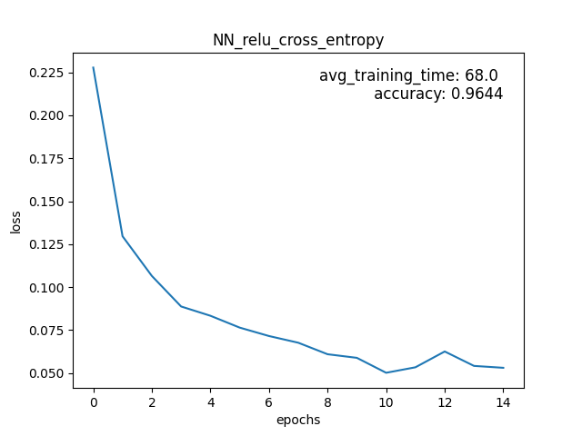
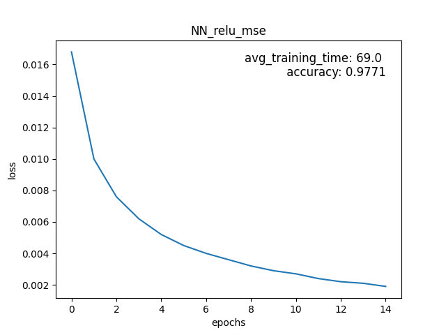
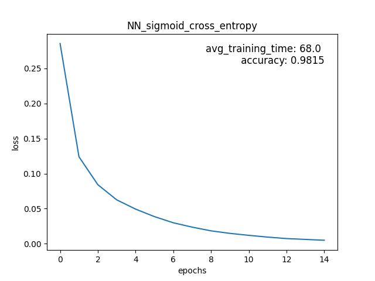
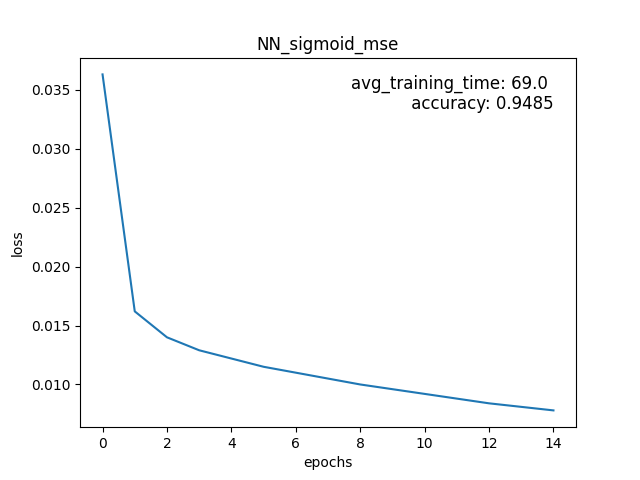

# PNN

## Installation

Install via poetry or use requirements.txt. Additionally use
```
pip install . 
```
to install the package and make the src files importable for the tests and run.py (may also be installed in editable mode with -e). 

Training the models can be done via the run.py and will just rerun and overwrite the models and figures shown below.

## Benchmarks NN









In above figures it can be seen that the sigmoid activation function worked better in conjunction with cross entropy loss and that relu worked better with mse. The Networks might still benefit from further training periods, because the loss was still going down. 