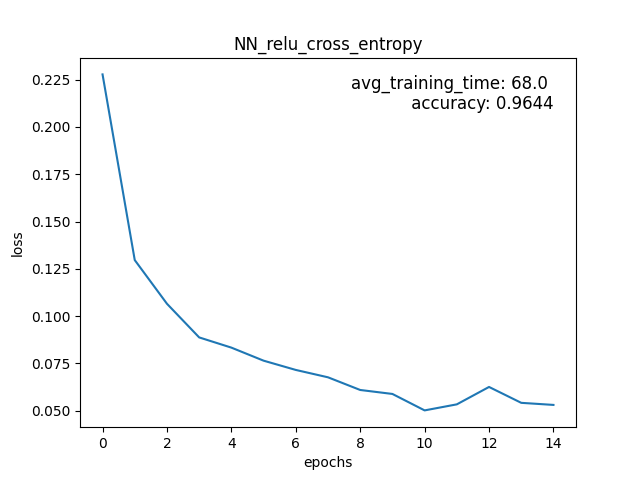
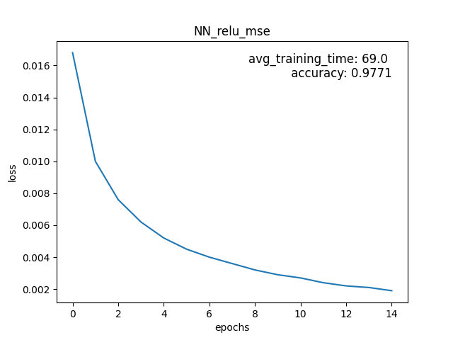
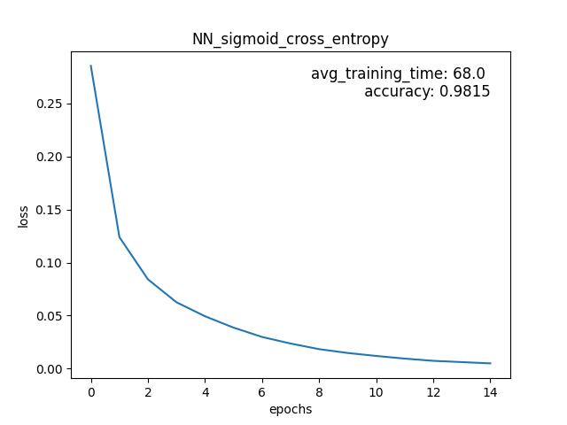
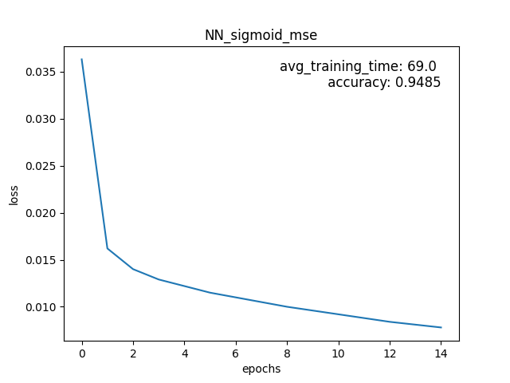
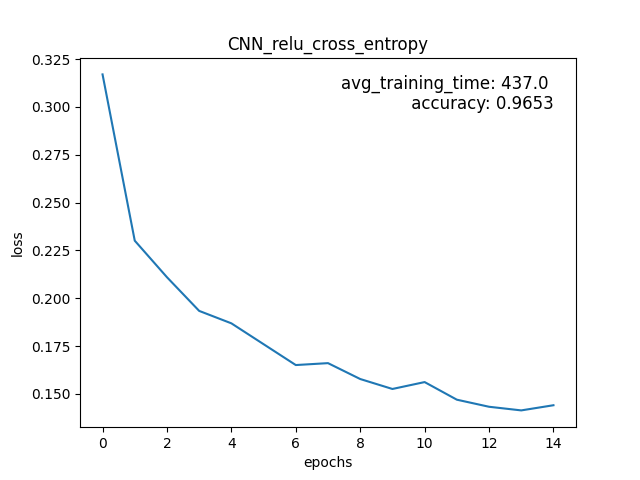
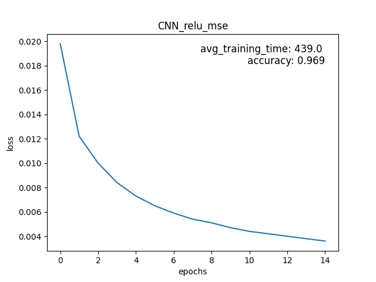
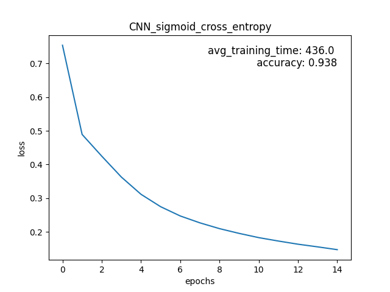
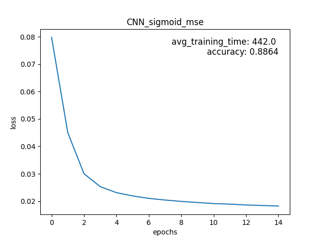

# PNN

## Installation

Install via poetry or use requirements.txt. Additionally use
```
pip install . 
```
to install the package and make the src files importable for the tests and run.py (may also be installed in editable mode with -e). 

Training the models can be done via the run.py and respectively the run_cnn.py for the Convolutional NN. This will create a new folder called figures that contains the lossgraph with average training time and an accuracy messure for the test data after the specified amount of epochs

## Benchmarks NN









In above figures it can be seen that the sigmoid activation function worked better in conjunction with cross entropy loss and that relu worked better with mse. The Networks might still benefit from further training periods, because the loss was still going down. 

## Benchmarks CNN









In comparison to the normal NN the CNN did perform worse, especially when using sigmoid activation function. This is probably due to overfitting issues, which can be inferred by looking at the loss graph. The loss is declining for every epoch, but the accuracy in the end is worse then the accuracy when only training 1 epoch (tested and lead to a 91% accuracy). The CNN would most likely benefit from Regularization techniques. 